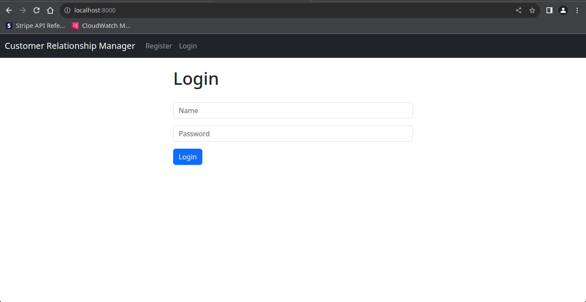

# Customer Relationship Management

## About
This is a _Customer Relationship Management Application_ made using the `django` framework in `Python`, `HTML`, `CSS` and `Javascript`.
 
## Author
Dipto Bhattacharjee

## Project Version
1.0.0

## Built With
* `Python` (version=3.11.3)
* `Django` (version=4.2.4)
* `pip` (version=22.3.1)

## Getting Started

### Prerequisites And Installation

- Make sure you have `pip` and `Python` installed in your computer.
- The python dependencies are mentioned in the file `requirements.txt`, you can run the following ```pip install -r requirements.txt``` or ```python -m pip install -r requirements.txt``` in order to install the dependencies.
- In terminal, navigate to the `crm` directory and then run the following command `python manage.py runserver` this will run the website in `localhost` at `PORT=8000` i.e. the service will operate at `http://localhost:8000/`.
- In order to terminate the service press `CTRL-C` this will interrupt the currently running process.
- In case of deploying at Production change the value of `DEBUG` to `False` i.e. make `DEBUG = False` in the 
`crm/settings.py` file.

## Screenshots




